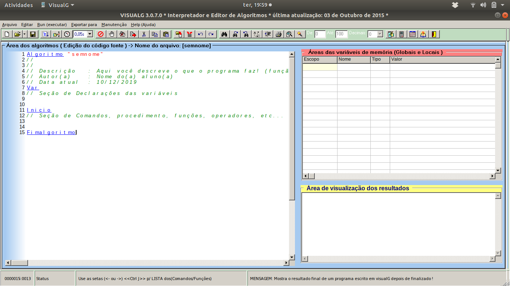

```{r setup, include=FALSE}
knitr::opts_chunk$set(echo = TRUE, cache = TRUE)
```

---

# Introdução

Através da programação é possível automatizar processos, isto é, tarefas que seriam feitas manualmente por seres humanos passam a ser realizadas total ou parcialmente pelo computador. Isto gera um ganho enorme de tempo e, caso tudo seja bem estruturado, não há perda de qualidade; em muitos casos há até ganho de qualidade pois as falhas humanas não serão mais inerentes ao processo.

A sequência de passos a ser seguida para realização de uma tarefa é chamada de **algoritmo**. Para que o computador realize esta sequência de passos é necessário que isso esteja especificado de uma forma que a máquina entenda, isto é, através de um **programa** escrito em uma **linguagem de programação**.

Portanto, um programa de computador é um algoritmo escrito em uma linguagem de programação. Existem diversas linguagens, como Java, Python, C, PHP, dentre outras. Cada uma com suas peculiridades, isto é, em cada linguagem a forma que se escreve é diferente. 

Contudo, as estruturas existentes nas linguagens são as mesmas e, por este motivo, é interessante compreender bem estas estruturas de forma genérica para que seja mais simples generalizá-las para diferentes linguagens de programação.

**Entenda: é mais fácil você aprender a lógica (que é geral e genérica) antes da linguagem (que é única e segue padrões próprios).**

Existem formas de se representar algoritmos fora de uma linguagem de programação. As principais são: a **descrição narrativa**, o **fluxograma** e o **pseudocódigo**. A mais interessante das 3 é o **pseudocódigo**, também chamado de **portugol** ou **português estruturado**. É a mais próxima de uma linguagem de programação real e, por este motivo, a mais simples de "traduzir" para uma linguagem.

Sendo assim, neste post a ideia é apresentar as principais estruturas para que seja possível compreender a lógica das linguagens de programação e escrever um algoritmo em pseudocódigo.

---

<center>

</center>

---

# Visualg

Como já mencionado, a representação de algoritmos através de pseudocódigo é uma das formas mais eficientes de se compreender a lógica de programação. Em tempos remotos, o estudo de algoritmos por pseudocódigo era feito com papel e caneta. Atualmente existem ferramentas que auxiliam no aprendizado de lógica de programação e algoritmos, isto é, aplicativos que interpretam e executam um algoritmo escrito em pseudocódigo. Desta forma é mais simples verificar o funcionamento do código e identificar erros. Uma interessante ferramenta para este propóstito é o [visualg](http://visualg3.com.br/). Segundo a descrição dos próprios autores:

*"O Visualg é um programa que permite criar, editar, interpretar e que também executa os algoritmos em português estruturado (portugol) como se fosse um “programa” normal de computador."*


Eis o aspecto do aplicativo:

<center>

</center>

$$\\$$

A estrutura básica de um algoritmo no **visualg** tem a seguinte forma:

```{r, eval=FALSE}
Algoritmo "Nome do algoritmo"

Var

Inicio
Fimalgoritmo
```

Inicia-se com `Algoritmo` e declara-se o nome do algoritmo. Na seção `Var` são declaradas as variáveis (nomes e tipos) que serão usadas no código. E entre `Inicio` e `Fimalgoritmo` são escritos os comandos. 

O **visualg** é facilmente instalado em qualquer sistema operacional e recomendo fortemente àqueles que desejam aprender ou mesmo revisar algoritmos e lógica de programação.

---

# Comandos de saída

O visualg tem 2 comandos de saída, isto é, comandos que vão retornar algo ao usuário. São eles: `Escreva` e `Escreval`. A diferença entre eles é a que o Escreval quebra uma linha antes de mostrar em tela o que foi solicitado. No visualg basta escrever: `Escreva("Qualquer coisa")` ou `Escreval("Qualquer coisa")`, executar, e a mensagem "Qualquer coisa" será printada em tela.

A estrutura do código seria algo como:

```{r, eval=FALSE}
Algoritmo "Escreva"

Var

Inicio
   Escreval("Qualquer coisa")
Fimalgoritmo
```

Note como o `Escreval("Qualquer coisa")` está a frente, isto é, há um espaço antes. Isto é usualmente feito para deixar o código mais organizado, de forma que saibamos que o `Escreval` está **dentro** do `Inicio` e `Fimalgoritmo`, esta técnica é chamada **indentação** e não é obrigatória, contudo, códigos indentados são bem mais atrativos.

Portanto, indentar é afastar o texto da margem. Em linguagens de programação consiste em escrever o código afastado por espaço da margem de forma que a escrita fique disposta hierarquicamente, para facilitar a visualização e percepção do programa.

---

# Variáveis

Uma **variável** é nada mais que uma entidade em que algo é armazenado, em geral variáveis são utilizadas para armazenar informações que serão recorrentemente usadas no código. No visualg há a seção `Var`, na qual deve-se declarar o identificador (nome) da variável e seu tipo. Algumas convenções para declarar nomes para variáveis são:

1. Deve sempre iniciar com uma letra. Após a letra números são permitidos.
2. Símbolos costumam não ser permitidos, com exceção do "_".
3. Espaços em branco não são permitidos.
4. Acentos não são permitidos.
5. Palavras reservadas da linguagem não são permitidas.

A maioria das regras é autoexplicativa e varia pouco de linguagem para linguagem. Esclarecendo a 5ª regra: palavras reservadas são palavras utilizadas pela linguagem com alguma finalidade. Por exemplo, no visualg a palavra Inicio serve para especificar que a partir dali serão escritos os códigos que deverão ser interpretados pelo computador; como a palavra Inicio tem esta finalidade, ela é uma palavra reservada e não pode ser usada para nomear uma variável. 

Além do nome é necessário declarar o tipo da variável, os tipos primitivos são:

 - Inteiro: números inteiros (não fracionários). Ex: 1, -2, 19, 434, etc.
 - Real: números reais (inteiros e fracionários). Ex: 1.2, -19.0, 0.5, etc.
 - Caractere: palavras. Ex: "exemplo", "palavra", "123", etc.
 - Lógico: verdadeiro ou faso.

No visualg a seção `Var` é utilizada da seguinte forma:

```{r, eval=FALSE}
Var
  indentificador:tipo
```

Para atribuir valores às variáveis declaradas, utiliza-se o símbolo "<-", lê-se "recebe". Por exemplo, caso haja uma variável nomeada como x e declarada como inteiro, poderíamos colocar entre o `Inicio` e `Fimalgoritmo` algo como: x <- 10; a partir deste momento, na memória do computador, x vale 10 e todas as operações são válidas.

No ensino de algoritmos e lógica de programação, a declaração de variáveis é controversa. Alguns professores exigem que o programa seja todo escrito de cima para baixo, o que obriga o aluno a declarar todas as variáveis que serão usadas antes de escrever o código. Na prática não é usual fazer desta forma; em geral começamos a escrever o código e, se precisamos de uma variável para armazenar um valor, voltamos para a seção `Var` e a declaramos.

---

# Comando de entrada

Os comandos de entrada servem para ler alguma informação a ser fornecida pelo usuário. No visualg existe o comando `Leia`, ele exige que o usuário informe um valor a ser armazenado em uma variável previamente declarada. Um exemplo é:

```{r, eval=FALSE}
Algoritmo "Nome"

Var
   nome: caractere

Inicio
   Escreval("Qual é o seu nome?")
   Leia(nome)
   Escreval("Olá, ", nome)
Fimalgoritmo
```

Ao executar o algoritmo será printada a mensagem que pergunta qual o nome do usuário, então o usuário informa seu nome, que será armazenado na variável nome que foi declarada como caractere e, após isso, a variável foi utilizada para um último `Escreval`. 

Importante notar que o `Leia(nome)` exige que o usuário informe o valor que será armazenado na variável, caso ele não forneça o programa fica parado. Note também como o último `Escreval` foi utilizado para printar um fragmento de texto (que está entre aspas) concatenado com o valor que foi armazenado na variável.

Considere o problema de calcular a soma de 2 números fornecidos pelo usuário, uma solução possível é:

```{r, eval=FALSE}

algoritmo "soma2n"

var
   n1,n2,soma: inteiro

inicio

      escreval("Informe o primeiro número")
      leia(n1)
      
      escreval("Informe o segundo número")
      leia(n2)
      
      soma <- n1+n2
      escreval(n1,"+",n2, "=",soma)

fimalgoritmo

```

Note como neste programa todas as estruturas apresentadas foram utilizadas: variáveis foram declaradas, comandos de saída e entrada foram utilizados, bem como uma atribuição para armazenar a soma em uma variável.

---

# Operadores aritiméticos

Os operadores aritméticos servem para realizar operações matemáticas básicas. Podem haver mudanças sutis em como os operadores são representados em algumas linguagens. No visualg as representações são:

| Operador 	|          Operação         	|
|:--------:	|:-------------------------:	|
|     +    	|           Adição          	|
|     -    	|         Subtração         	|
|     *    	|       Multiplicação       	|
|     /    	|          Divisão          	|
|     \    	|      Divisão inteira      	|
|     ^    	|       Exponenciação       	|
|     %    	| Módulo (resto da divisão) 	|

Os operadores seguem uma hierarquia, ou seja, uma ordem de precedência. Inicialmente são efetuadas as operações entre parênteses seguindo a ordem: exponenciação, multiplicação/divisão e por fim adição/subtração. Note como a ordem de precedência não é exclusiva de algoritmos, ela segue a mesma lógica das operações matemáticas usuais.

As funções aritméticas não triviais variam de acordo com a linguagem, o visualg possui:

| Operador 	|            Operação            	|
|:--------:	|:------------------------------:	|
|    Abs   	|         Valor absoluto         	|
|    Exp   	|          Exponenciação         	|
|    Int   	|          Valor inteiro         	|
|   RaizQ  	|          Raiz quadrada         	|
|    Pi    	|            Número pi           	|
|    Sen   	|        Seno em radianos        	|
|    Cos   	|       Cosseno em radianos      	|
|    Tan   	|      Tangente em radianos      	|
| GraupRad 	| Transforma graus para radianos 	| 

---

# Operadores relacionais

Os operadores relacionais são utilizados para comparar valores das variáveis e sempre retornam valores lógicos, ou seja, **verdadeiro** ou **falso**. No visualg, os operadores relacionais são:

| Operador 	|      Operação      	|
|:--------:	|:------------------:	|
|     >    	|      Maior que     	|
|     <    	|      Menor que     	|
|    >=    	| Maior ou igual que 	|
|    <=    	| Menor ou igual que 	|
|     =    	|        Igual       	|
|    <>    	|      Diferente     	|

Considere que o problema de interesse é comparar 3 números fornecidos pelo usuário, uma solução possível é dada por:

```{r, eval=FALSE}
algoritmo "3compara3n"

var
   a,b,c: inteiro

inicio
      escreval("Digite o primeiro valor")
      leia(a)
      escreval("Digite o segundo valor")
      leia(b)
      escreval("Digite o terceiro valor")
      leia(c)
      
      escreval()
      escreval(a," é igual a",b,"?",a=b)
      escreval(a," é igual a",c,"?",a=c)
      escreval(b," é igual a",c,"?",b=c)
      escreval()
      escreval(a," é maior que",b,"?",a>b)
      escreval(a," é maior que",c,"?",a>c)
      escreval(b," é maior que",c,"?",b>c)
      escreval()
      escreval(a," é maior que ",b," ou maior que ",c,"?",(a>b)ou(a>c))
      escreval()
      
fimalgoritmo
```

---

# Operadores lógicos

Os operadores lógicos, assim como os relacionais, retornam resultados lógicos. Contudo sua finalidade é outra, diferentemente dos aritméticos eles servem para comparar outros resultados lógicos. No visualg existem 3 operadores lógicos: **E**, **OU** e **NÃO**. Para exemplificar o funcionamento dos operadores, considere as variáveis p e q:

 - Se p é verdaeiro e q é verdadeiro, então **p E q** resulta em **verdadeiro**.
 - Se p é verdaeiro e q é falso, então **p E q** resulta em **falso**.
 - Se ambos são falsos, então **p E q** resulta em **falso**.

Já para o operador **OU**, se qualquer uma das opções for verdadeira, o resultado será verdadeiro. Por fim, o operador **NÃO** trabalha com negativas, por exemplo: se p é verdadeiro, **NÃO** p é falso.

Lembre-se que para utilizar os operadores lógicos é necessário comparar resultados lógicos, e que operadores relacionais geram resultados lógicos. Portanto é possível utilizar operadores lógicos com relacionais. Por exemplo: **(A=B) OU (A=C)**, **(A>B) E (A=C)**, etc.

Os operadores lógicos são os últimos da hierarquia de precedência, pois inicialmente são efetuadas as operações aritméticas, depois as relacionais e, por fim, as operações lógicas.

---

# Estruturas condicionais

Uma estrutura condicional é utilizada quando a ação a ser tomada depende de uma condição ser ou não satisfeita, algo como: se tal coisa acontecer faça isso, senão faça aquilo. Em pseudocódigo isso é escrito da seguinte forma:

```{r, eval=FALSE}
Se (condição) entao
  bloco 
FimSe  
```

Quando uma ação é tomada apenas se a condição de interesse for verdadeira, temos uma **condicional simples**. Para ilustrar considere o problema em que o usuário informa a idade e o programa retorna se ele pode ou não tirar carteira de motorista:

```{r, eval=FALSE}
algoritmo "cnh"

var
   idade: inteiro

inicio

   escreval("Quantos anos completos você tem?")
   leia(idade)
   
   escreval()

   se idade >= 18 entao
      escreval("Você é maior de idade, logo, pode tirar sua CNH.")
   fimse

fimalgoritmo
```

Note que se o usuário for menor de idade o programa encerra, pois não há instrução para caso a condição não seja satisfeita. Podemos melhorar essa condicional acrescentando um bloco de código que será executado caso a condição não seja atendida, isso é feito complementando a estrutura simples com um `senão` da seguinte forma:

```{r, eval=FALSE}
Se (condição) entao
  bloco1
Senao
  bloco2
FimSe  
```

A esta estrutura damos o nome de **condicional composta**. Melhorando o programa que retorna se o usuário pode ou não tirar carteira de motorista:

```{r, eval=FALSE}
algoritmo "cnh"

var
   idade: inteiro

inicio

   escreval("Quantos anos completos você tem?")
   leia(idade)
   
   escreval()

   se idade >= 18 entao
      escreval("Você é maior de idade, logo, pode tirar sua CNH.")
   senao
      escreval("Você ainda é menor de idade, portanto, não pode tirar sua CNH.")
   fimse

fimalgoritmo
```

Note, além da apresentação da estrutura, como a indentação funciona e torna o código mais legível. Algumas linguagens possuem indentador automático, contudo é importante não se acostumar com esta ferramenta imaginando que algum dia pode ser necessário trabalhar com alguma linguagem que não possua tal artifício.

Outra situação que envolve condições são as chamdas **condicionais aninhadas**, trata-se da situação quando necessitamos de diversas condicionais, uma dentro da outra. Genericamente em pseudocódigo, a situação em que temos duas possíveis condições que podem ser satisfeitas fica da seguinte forma:

```{r, eval=FALSE}
Se (condição1) entao
  bloco1
Senao
  Se (condição2) entao
    bloco2
  Senao
    bloco3
  FimSE  
FimSe
```

Desta forma temos quantas condicionais forem necessárias e blocos a ser executados para cada uma das situações. Por exemplo, considere o problema em que o usuário fornece o peso e a altura, o programa retorna o IMC (massa/altura^2) e uma mensagem a respeito do IMC. As mensagens são:

 - Se o IMC for menor que 17: "Você está muito abaixo do peso."
 - Se estiver entre 17 e 18,5: "Você está abaixo do peso."
 - Se estiver entre 18,5 e 25: "Você está no peso ideal."
 - Se estiver entre 30 e 35: "Você está com obesidade."
 - Se estiver entre 35 e  40: "Você está com obesidade severa."
 - Se for maior que 40: "Você está com obesidade mórbida."
 - Se nehuma das condições for aceita: "O peso e/ou a altura informados estão incorretos."

Uma possível solução é:

```{r, eval=FALSE}
algoritmo "imc"

var
   peso, altura, imc: real

inicio
   escreval("Informe seu peso(Kg)")
   leia(peso)
   escreval("Informe sua altura(m)")
   leia(altura)

   imc <- peso/(altura^2)

   escreval("Seu IMC é igual a ", imc, ".")

   se imc<=17 entao
      escreval("Você está muito abaixo do peso.")
   senao
      se (imc>17) e (imc<=18.5) entao
         escreval("Você está abaixo do peso.")
      senao
         se (imc>18.5) e (imc<=25) entao
            escreval("Você está no peso ideal.")
         senao
            se (imc>30) e (imc<=35) entao
               escreval("Você está com obesidade.")
            senao
               se (imc>35) e (imc<=40) entao
                  escreval("Você está com obesidade severa.")
               senao
                  se imc>40 entao
                     escreval("Você está com obesidade mórbida.")
                  senao
                     escreval("O peso e/ou a altura informados estão incorretos.")
                  fimse
               fimse
            fimse
         fimse
      fimse
   fimse
fimalgoritmo
```

A última estrutura condicional a ser apresentada é também chamada de **estrutura de escolha**, ou **escolha/caso** e tem a seguinte forma:

```{r, eval=FALSE}
escolha variável
  caso valor 
    bloco1
  caso valor
    bloco2
  outrocaso
    bloco3
fimescolha
```

A **estrutura de escolha** é uma opção bem mais simples que a solução de **condicionais aninhadas**, contudo há uma importante restrição: ela serve apenas para valores inteiros, ou seja, para variáveis que assumem valores inteiros; não sendo possível desta forma testar faixas de valores como foi feito no caso do IMC. Em certas linguagens esta estrutura pode ser usada em algumas outras situações, mas em geral é destinada apenas para o caso de valores inteiros.

Considere que uma empresa quer reajustar o salário dos seus funcionários baseado no número de dependentes financeiros de tal forma que: 

 - Caso o funcionário não tenha dependentes, o reajuste seja 5%.
 - Caso tenha de 1 a 3 dependentes, o reajuste seja 10%.
 - Caso tenha de 4 a 6 dependentes, o reajuste seja 15%.
 - Caso tenha mais de 6 dependentes, o reajuste seja 18%.

Uma solução para o problema é:

```{r, eval=FALSE}
algoritmo "novosalario"

var
   sal, novosal: real
   dep: inteiro

inicio
   escreval("informe o salario do funcionário")
   leia(sal)

   escreval("informe o numero de dependentes do funcionário")
   leia(dep)

   escreval("atualmente recebe", sal, " reais")
   escreval("e possui",dep, " dependentes.")

   escolha dep
   caso 0
      novosal <- sal+(sal*0.05)
   caso 1,2,3
      novosal <- sal+(sal*0.1)
   caso 4,5,6
      novosal <- sal+(sal*0.15)
   outrocaso
      novosal <- sal+(sal*0.18)
   fimescolha

   escreval("O salário reajustado é igual a ", novosal, "  reais,")

fimalgoritmo

```


---

# Estruturas de repetição

As **estruturas de repetição** permitem executar mais de uma vez um mesmo bloco de código sob determinadas condições quantas vezes forem necessárias. Por se tratar de uma ou mais operações que se repetem, também são chamadas de **laços interativos** ou **loops**.

A primeira forma de se utilizar uma estrutura de repetição é com o **enquanto**, de tal forma que dizemos: "enquanto a condição não for aceita faça tal coisa". Normalmente a condição está associada a um contador, genericamente em pseudocodigo:

```{r, eval=FALSE}
enquanto contador<=numero faca
	bloco
  contador<-contador+incremento
fimenquanto
```

Considere o problema em que o usuário fornece um valor inicial, um valor final, um incremento e o programa faz a contagem do valor inicial até o final. Utilizando o enquanto, uma solução é:

```{r, eval=FALSE}
algoritmo "contagem_enquanto"

var
   i,inicial,final,incremento:inteiro

inicio

   escreval("Digite o valor inicial")
   leia(inicial)
   escreval("Digite o valor final")
   leia(final)
   escreval("Digite o incremento")
   leia(incremento)

   escreval("-------------------------------")
   escreval("Irei contar de ",inicial," até ",final," de ",incremento, " em ", incremento.)
   escreval("-------------------------------")

   i<-inicial

   enquanto i<=final faca
      escreval(i)
      i<-i+incremento
   fimenquanto
   escreval("Fim do laço.")

fimalgoritmo
```

Melhorando a solução, podemos fazer com que o algoritmo detecte se o valor incial é menor ou maior que o final e realizar uma contagem progressiva ou regressiva:

```{r, eval=FALSE}
algoritmo "contagem_enquanto"

var
   i,inicial,final,incremento,soma:inteiro

inicio

   escreval("Digite o valor inicial")
   leia(inicial)
   escreval("Digite o valor final")
   leia(final)
   escreval("Digite o incremento")
   leia(incremento)

   escreval("-------------------------------")
   escreval("Irei contar de ",inicial," até ",final," de ",incremento, " em ", incremento.)
   escreval("-------------------------------")

   soma <-0

   se final>inicial entao
      escreval("Contagem progressiva detectada.")
      i<-inicial

      enquanto i<=final faca
         escreval(i)
         soma<-soma+i
         i<-i+incremento
      fimenquanto
      escreval("A soma dos números é igual a ", soma)
      escreval("Fim do laço.")

   senao
      escreval("Contagem regressiva detectada.")
      i<-inicial

      enquanto i>=final faca
         escreval(i)
         soma<-soma+i
         i<-i-incremento
      fimenquanto
      escreval("A soma dos números é igual a ", soma)
      escreval("Fim do laço.")

   fimse
   
fimalgoritmo
```

Note que para solução deste problema foi necessário utilizar estruturas condicionais e de repetição além de comandos de entrada, saída, operadores aritméticos e atribuições.

A segunda estrutura de repetição é a **repita**, sua sintaxe é da seguinte forma:

```{r, eval=FALSE}
Repita
  bloco
Ate condição  
```

É uma estrutura extremamente parecida com o **enquanto**, porém é logicamente inversa. Trata-se de uma estrutura alternativa ao enquanto em que o teste lógico é feito no final da estrutura, e não no começo. Compare:

 - Enquanto a condição não for aceita faça tal coisa.
 - Faça tal coisa até que a condição seja aceita.
 
Para exemplificar, considere o problema em que o usuário fornece um valor e o programa retorna a tabuada deste valor:

```{r, eval=FALSE}
algoritmo "tabuada"

var
   i,valor:inteiro
   
inicio
      escreval("Qual tabuada você deseja ver?")
      leia(valor)

   i <-0
   repita
      escreval(valor,"x",i,"=",valor*i)
      i<- i+1
   ate i>10

fimalgoritmo
```

Outro exemplo com a estrutura repita, considere que o problema de interesse é calcular o fatorial de um número fornecido pelo usuário e que, ao invés de efetuar a conta e o programa ser encerrado, queremos que o programa pergunte para o usuário se ele deseja ou não continuar, de tal forma que ele vai fornecer outro número, outro fatorial será efetuado e assim por diante, até que o usuário diga que não quer mais efetuar nenhum fatorial. Uma solução possível é:

```{r, eval=FALSE}

Algoritmo "fatorial"

Var
   n,fatorial,i:inteiro
   resp:caractere

Inicio
   repita
      escreval("Informe o numero que voce gostaria de obter o fatorial")
      leia(n)

      fatorial <- 1

      i <- n

      repita
         fatorial <- fatorial*i
         i<-i-1
      ate i=1

      escreval(n, "! = ", fatorial)
      escreval("Deseja continuar? [s/n]")
      leia(resp)

   ate resp="n"

Fimalgoritmo

```


A última das estruturas de repetição é o **para**, cuja sintaxe é dada por:

```{r, eval=FALSE}
para (variavel) de (inicio) ate (fim) passo (incremento) faca
      bloco
fimpara
```

O **para** é uma das estruturas mais utilizadas e possui uma vantagem sobre as outras duas apresentadas: ela é auto incrementável, isto é, não há necessidade de especificar que uma variável contadora recebe ela mesma mais um incremento, o **para** faz isso automaticamente o que exige menos código para realização de uma tarefa que exige repetição. 

Contudo, é uma estrutura que exige um limite superior, isto é, no **para** o número de vezes que o loop será executado é fixo. O que não acontece no **enquanto** e no **repita**, estruturas nas quais podemos escrever de tal forma que o usuário forneça quantos valores quiser com uma estrutura do tipo:

```{r, eval=FALSE}

Inicio
   repita
      escreval("Deseja continuar? [s/n]")
   ate resp="n"
Fimalgoritmo
```

Veja um algoritmo que conta até 10 utilizando o para:

```{r, eval=FALSE}
algoritmo "conta10_para"

var
   i:inteiro

inicio
   para i de 1 ate 10 passo 1 faca
      escreval(i)
   fimpara
fimalgoritmo
```

Como exemplo mais completo, considere que precisamos escrever um programa que lê quantos valores o usuário quiser, retorna quantos estão entre 0 e 10 e a soma dos ímpares. Uma solução é dada por:

```{r, eval=FALSE}
Algoritmo "entre010"

Var
   qtd, i, valor, cont, somaimpar:inteiro
   
Inicio
   escreva("Quantos valores vamos analisar?")
   leia(qtd)
   cont <- 0
   somaimpar <- 0

   para i de 1 ate qtd faca
      escreva("digite o ",i,"º valor")
      leia(valor)

      se (valor<=10) e (valor>=0) entao
         cont <- cont+1
      fimse

      se (valor%2<>0) e (valor<=10) e (valor>=0) entao
         somaimpar <- somaimpar+valor
      fimse
   fimpara

   escreval("Existem ", cont, " números entre 0 e 10")
   escreval("A soma entre os impares digitados é  ", somaimpar)

Fimalgoritmo
```

---

# Considerações finais

Como mencionado anteriormente a lógica de programação é indispensável para quem deseja aprender uma linguagem. Tentar aprender a linguagem antes da lógica ou ambos ao mesmo tempo não está errado, porém gera um problema de generalização, tornando estudar novas linguagens uma tarefa mais árdua. 

Por isso, entender comandos, operadores e estruturas é algo salubre para aqueles que trabalham com programação pois, aprendendo estas estruturas com qualidade é infinitamente mais fácil passar para outras linguagens. 

As linguagens têm suas peculiaridades, coisas que funcionam em uma, não funcionam em outra; todavia as estruturas gerais sempre estarão lá com uma ou outra diferença sutil de sintaxe. 

Sendo assim, uma forma de entender as ferramentas que existem em qualquer linguagem e praticá-las é através do português estruturado (portugol) em aplicativos como o visualg.

Neste material todos os tópicos foram tratados de maneira ampla sem entrar com grandes detalhes nos assuntos ou resolver problemas com nível de dificuldade elevada. Porém lembre-se que programação, tal como matemática ou qualquer outra habilidade, exige prática para que a proficiência seja elevada.

Tópicos não abordados neste post foram vetores, matrizes, funções e procedimentos numa tentativa de tornar o material menos extenso.

---

Existe uma infinidade de materiais e cursos online a respeito do tema aqui abordado. Uma que gosto muito e considero bastante acessível é a playlist [Curso de Lógica de Programação](https://www.youtube.com/playlist?list=PLHz_AreHm4dmSj0MHol_aoNYCSGFqvfXV).


---

Críticas e sugestões a este material sempre serão bem vindas.

Para entrar em contato comigo, envie uma mensagem para <lineuacf@gmail.com>.

---

<div class="tocify-extend-page" data-unique="tocify-extend-page" style="height: 0;"></div>