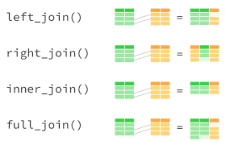

---
output:
  html_document:                    # Classe de documento.
    toc: true                       # Exibir sum?rio.
    toc_depth: 2                    # Profundidade do sum?rio.
    toc_float:                      # Sum?rio flutuante na borda.
      collapsed: true
      smooth_scroll: true
    number_sections: true           # Se??es numeradas.
    theme: cosmo
    #default,cerulean,journal,flatly,readable,spacelab,
    #united,cosmo,lumen,paper,sandstone,simplex,yeti
    
    highlight: espresso
    #default, tango, pygments, kate, monochrome, espresso, zenburn, haddock, and textmate
    #css: styles.css                 # Caminho para arquivo CSS.
    fig_width: 7                    # Lagura das figuras.
    fig_height: 6                   # Altura das figuras.
    fig_caption: true               # Exibica??o de legenda.
    fig_align: 'center'
#    code_folding: hide              # Esconder/exibir bloco de c?digo.
#    keep_md: true                   # Manter o arquivo md.
    #template: quarterly_report.html # Caminho para o template.  
---

```{r setup, include=FALSE}
knitr::opts_chunk$set(echo = TRUE, cache = TRUE)
library(tidyverse)
```

---

<center>

</center>

---

<font size="8"> 
<p align=”center”> <b> Primeiros Passos com `tidyr` e `dplyr`</b> </center>
</font> 

<font size="4"> 
<p align=”center”> Lineu Alberto Cavazani de Freitas </center>
</font> 

---

# Formatação e Tratamento de Dados

Vamos imaginar o processo de análise de um conjunto de dados, você precisa:

<center>
**IMPORTAR - ARRUMAR - TRANSFORMAR - VISUALIZAR - MODELAR - COMUNICAR**
</center>

<center>

</center>

---

Cada uma delas consiste em:

1. **Importar** os dados brutos para o software de análise.
2. **Arrumar** os dados, isto é, fazer com que eles fiquem em um formato adequado para análise.
3. **Transformar** os dados, isto é, criar novas variáveis com base nas que foram coletadas, obter resumos numéricos das variáveis de interesse, etc.
4. **Visualizar** os dados, verificar o comportamento das variáveis e como elas interagem entre si fazendo uso de recursos gráficos. Leia o post [Primeiros Passos com ggplot2](https://pet-estatistica.github.io/site/download/posts/postLINEU.html) e entenda mais esta etapa.
5. **Modelar** os dados, isto é, aplicar técnicas que vão além da visualização e permitam compreender os dados e aprender com eles.
6. **Comunicar** os resultados.

---

**Arrumar** e **Transformar** os dados podem se tornar os piores pesadelos de estatísticos, cientistas de dados e aficcionados por análise. Estas duas etapas são de suma importância para uma análise consistente de dados e podem ser consideradas as mais demoradas, trabalhosas e desgastantes tarefas no processo de análise. Além disso são, sem dúvidas, etapas extremamente negligenciadas nos cursos de graduação e extremamente exigidas no mercado.

Existem diversos pacotes que permitem arrumar e transformar os dados, mas dois em especial merecem atenção: o [tidyr](https://tidyr.tidyverse.org/) e o [dplyr](https://dplyr.tidyverse.org/). Estes pacotes são 2 componentes dos 8 pacotes básicos do [tidyverse](https://www.tidyverse.org/packages/), se você nunca ouviu falar de tidyverse, trata-se de uma reimplementação das principais funcionalidades do R em um conjunto de 8 pacotes e uma série de vários outros secundários construídos para trabalhar em conjunto. 

A vantagem de se trabalhar com o tidyverse é que toda a sintaxe e filosofia das diferentes etapas de análise são centralizadas e unificadas e, além disso, há um pacote específico para cada tarefa do processo de análise de dados. Um bom material para se inteirar a respeito do tidyverse é a série de aulas [Manipulação e Visualização de Dados - A abordagem tidyverse](http://leg.ufpr.br/~walmes/cursoR/data-vis/) do professor [Walmes M. Zeviani](http://www.leg.ufpr.br/~walmes/home/) e o material do [Minicurso R 2019](https://pet-estatistica.github.io/site/minicurso_r_2019/) ofertado pelo [PET-Estatística UFPR](https://pet-estatistica.github.io/site/).

Mas voltando ao que interessa, nosso foco neste post é apresentar o objetivo e principais funcionalidades do [tidyr](https://tidyr.tidyverse.org/) (para arrumação) e o [dplyr](https://dplyr.tidyverse.org/) (para transformação).

---

<center>
<div>
  
  
</div>
</center>

---

Para instalação dos pacotes basta utilizar a função `install.packages()`, da seguinte forma:

```{r, eval=FALSE}
install.packages('tidyr')
install.packages('dplyr')
```

Ou ainda:

```{r, eval=FALSE}
install.packages('tidyverse')
```

Desta forma todos os pacotes pertencentes ao tidyverse serão instalados.

---

# `tidyr`

Antes de dar início à exploração do tidyr vamos definir o conceito de dado arrumado ou tidy data. Um conjunto de dados considerado arrumado é aquele em que cada coluna representa uma variável, cada linha representa uma observação e cada célula representa o valor observado da observação i na variável j:

<center>

</center>

Isto posto, vamos às principais funcionalidades do `tidyr`. Este pacote dispõe de funções para:

 - Empilhar/desempilhar os dados.
 - Separar/unir caracteres.
 - Tratar dados ausenstes (NA's).
 - etc.

---

## Empilhar/desempilhar os dados

Considere o seguinte conjunto de dados:

```{r}
td <- tibble(
  id = rep(1:50),
  jan = rnorm(50, rpois(1,(runif(1)*10))),
  fev = rnorm(50, rpois(1,(runif(1)*10))),
  mar = rnorm(50, rpois(1,(runif(1)*10))),
  abr = rnorm(50, rpois(1,(runif(1)*10))),
  mai = rnorm(50, rpois(1,(runif(1)*10))),
  jun = rnorm(50, rpois(1,(runif(1)*10))),
  jul = rnorm(50, rpois(1,(runif(1)*10))),
  ago = rnorm(50, rpois(1,(runif(1)*10))),
  set = rnorm(50, rpois(1,(runif(1)*10))),
  out = rnorm(50, rpois(1,(runif(1)*10))),
  nov = rnorm(50, rpois(1,(runif(1)*10))),
  dez = rnorm(50, rpois(1,(runif(1)*10))))

td
```

Use a imaginação, finja que cada valor de id é uma pessoa, cada coluna um mês e cada célula o resultado de um exame qualquer. Este é o típico caso de dados no formato largo, ou seja, a linha representa uma observação mas note que as colunas representam a mesma variável: o mês. No formato tido como ideal deveria haver uma coluna id e uma coluna mês e não 12 colunas de uma mesma variável. 

Para forçar os dados a assumirem o formato longo basta utilizar a função `gather`, nesta função você fornece o nome de duas colunas a serem criadas: a key e a value. Além disso deve-se informar as colunas que se tem interesse em empilhar.

```{r}
td_gat <- td %>% gather(key = 'mes', value = 'valor', jan:dez)
td_gat
```

Para fazer com que os dados retornem ao formato original basta utilizar a função `spread`:

```{r}
td_gat %>% spread(key=mes, value = valor)
```

Mas note a diferença, o fragmento anterior fez com que as colunas fossem colocadas em ordem alfabética.

---

## Separar/unir caracteres.

Imagine um exemplo simples, você coletou dia, mês e ano de nascimento de uma série de indivíduos mas cada um destes valores está em uma célula e você quer que isto fique numa única célula. Este é um caso clássico em que a função `unite` se mostra útil:

```{r}
dma <-
  tibble(dia = c(rpois(10, 10)),       
       mes = c(01,02,03,04,05,06,07,08,09,10),
       ano = c(1990,1994,1996,2001,2005,1955,1998,1999,2005,1955))

dma

dma2 <- dma %>% unite(col = 'data', sep = '-')
dma2

```

Para fazer com que os dados retomem o formato original uma candidata é a função `separate`:

```{r}
dma2 %>% separate(col = 'data',
                        into = c('dia', 'mes', 'ano'),
                        sep = '-')

```

Já que entramos no assunto datas, recomendo a leitura do post [Resolvendo problemas com datas e horas utilizando o pacote Lubridate](https://pet-estatistica.github.io/site/download/posts/postNILTON.html)

---

## Tratar dados ausenstes (NA's).

Dados ausentes são um assunto delicado. Há quem defenda a completa retirada de linhas com valores faltantes, há também quem defenda que estes valores tem algo a contar e devem permanecer na base. Fato é que em determinados métodos não há a possibilidade de trabalhar com uma base em que haja dados ausentes, como é o caso de modelos de regressão. Nestes casos nos restam algumas alternativas: retirar linhas em que haja algum NA, substituir NA's por alguma outra quantidade ou utilizar algum método de imputação. 

Não é o foco deste post discutir qual é mais recomendada ou coerente, mas sim mostrar as possibilidades com o `tidyr`, e são elas: retirar as linhas com NA com a função `drop_na()` ou substituir os NA's oir algum outro valor com a função `replace_na()`:

```{r}
NAS <- tibble(col1 = 1:10,
              col2 = c(1,2,NA,4,NA,6,7,NA,9,10))

NAS

NAS %>% drop_na()

NAS %>% replace_na(list(col2 = 100000))
```

---

# dplyr

O `dplyr` dispõe de funções para transformação do conjunto de dados. Isso envolve: filtrar linhas, selecionar colunas, ordenar a base, criar/modificar colunas, agrupar a base, sumarizar e cruzar diferentes bases. Considere o conjunto de dados `swiss`.

```{r}
swiss$names <- rownames(swiss)
dados <- swiss %>% as_tibble()
summary(dados)
```

---

## Filtrar linhas

A função filter funciona como um filtro de uma planilha Excel, você escolhe uma condição e o output serão apenas aquelas linhas em que a condição seja satisfeita. Seguem alguns exemplos utilizando a função `filter()`:

 - Filtro comum: filtre as linhas em que apenas esta condição seja satisfeita.
 - Filtro com condição &: filtre as linhas em que duas condições que sejam satisfeitas simultâneamente.
 - Filtro com condição |: filtre as linhas em que uma das duas condições seja atendida.
 - Filtro com condição %in%: filtre as linhas em que haja observações iguais às pertencenter ao vetor.

---

### Filtro comum

```{r}
filtro1 <- dados %>% filter(Fertility > 70)
nrow(dados) - nrow(filtro1)
```

23 observações não atendem à restrição.

---

### Filtro com condição &

```{r}
filtro2 <- dados %>% filter(Examination > 12 & Agriculture > 30)
nrow(dados) - nrow(filtro2)
```

24 observações não atendem à restrição.

---

### Filtro com condição |

```{r}
filtro3 <- dados %>% filter(Examination > 12 | Agriculture < 30)
nrow(dados) - nrow(filtro3)
```

14 observações não atendem à restrição.

---

### Filtro com condição %in%

```{r}
filtro4 <- dados %>% filter(names %in% c("Courtelary", "Delemont", "Franches-Mnt"))
nrow(dados) - nrow(filtro4)
```

44 observações não atendem à restrição.

---

## Selecionar colunas

A função `select()` é utilizada para selecionar colunas de um conjunto de dados, com esta função é possível:

 - Selecionar colunas pelo nome.
 - Selecionar colunas que iniciam com alguma letra ou sílaba específica.
 - Selecionar intervalos entre colunas.
 - Selecionar todas com exceção de algumas.

---

### Selecionando colunas pelo nome

```{r}
select1 <- dados %>% select(names, Education)
names(dados)
names(select1)
```

---

### Selecionando colunas que iniciam com

```{r}
select2 <- dados %>% select(starts_with("e"))
names(dados)
names(select2)
```

---

### Selecionando intervalo de colunas

```{r}
select3 <- dados %>% select(Fertility, Agriculture:Education)
names(dados)
names(select3)
```

---

### Selecionando todas as colunas exceto

```{r}
select4 <- dados %>% select(-Fertility, -names)
names(dados)
names(select4)
```

---

## Ordenar a base

Para ordenação com base em uma coluna o `dplyr` dispõe da função `arrange()`:

```{r}
df <- tibble(letras = letters,
             valor = rnorm(length(letters)))
df

df %>%  arrange(desc(letras))

df %>% arrange(letras)

```

---

## Criar/modificar colunas

A criação e modificação de colunas pode ser feita com a função `mutate()`, com ela é possível:

 - Sobrescreve uma coluna.
 - Criar uma nova coluna.
 - Criar diversas colunas no mesmo mutate.

```{r}
df2 <- tibble(col1 = rnorm(50), col2 = rpois(50, 1))
df2
```

---

### Sobrescreve uma coluna

```{r}
mutate1 <- df2 %>% mutate(col2 = letters[1:10] %>% rep(5))
df2[,2]
mutate1[,2]
```

---

### Criar uma nova coluna

```{r}
mutate2 <- df2 %>% mutate(col3 = 1:nrow(df2))
df2
mutate2
```

---

### Criar diversas colunas no mesmo mutate.

```{r}
mutate3 <- df2 %>%  mutate( col3 = col1 + col2,
                            col4 = 1:nrow(df2),
                            col5 = col1 * 10)

df2
mutate3
```

---

## Agrupar e sumarizar

A função `summarise()` é a responsável por gerar resumos numéricos, o output desta função é um tibble em que você nomeia a coluna e especifica que medida será printada. Considere novamente o conjunto de dados `swiss`:

```{r}
swiss$names <- rownames(swiss)
dados <- swiss %>% as_tibble()
summary(dados)
```

---

### Obtendo uma única medida descritiva

```{r}
dados %>%
  summarise(mean_fert = mean(Fertility))
```

---

### Obtendo mais de uma medida descritiva

```{r}
dados %>%
  summarise(
    media_fert = mean(Fertility),
    mediana_fert = median(Fertility))
```

---

### Obtendo medidas descritivas de diferentes variáveis

```{r}
dados %>%
  summarise(
    media_fert = mean(Fertility),
    mediana_agr = median(Agriculture),
    sd_cat = sd(Catholic))
```

---

### Obtendo medidas descritivas por grupo

O `dplyr` possui a função `group_by()`. Esta função, quando combinada ao `summarise()` permite obter medidas descritivas por grupo. Imagine que você tem no seu conjunto de dados uma variável categórica de 3 níveis e uma variável contínua, combinando `group_by()` e `summarise()` você pode obter a média da variável contínua para cada nível da variável categórica sem muito esforço, veja:

```{r}
dados <- tibble(fator = rep(c('a','b','c'), 5),
                num = rnorm(length(fator), 15,5))

dados

dados %>%
  group_by(fator) %>%
  summarise(media_grupo = mean(num))
```

---

## Amostrar

Em alguns casos, para aplicação de métodos específicos, pode ser que seja interesse trabalhar com amostras dos dados. O `dplyr` possui duas funções para reamostragem: a `sample_n()` e a `sample_frac()`. Na primeira você informa quantas linhas do conjunto de dados original você deseja e na segunda a proporção de linhas do conjunto de dados original:

```{r}
dados 

dados %>% sample_n(5)

dados %>% sample_frac(0.1)
```

---

## Cruzamentos

As funções do tipo join servem para cruzar bases por uma coluna chave, as possíveis alternativas de cruzamento são:

 - `inner_join()`.
 - `full_join()`.
 - `left_join()`.
 - `right_join()`.
 
A `inner_join()` gera um novo conjunto de dados apenas para os casos em
que a chave é verificada nos dois arquivos. 

A `full_join()` une todas as linhas e todas as colunas, independente da chave ocorrer nos dois arquivos. Nos casos em que não há correspondência é gerado NA. 

Na `left_join()` todas as chaves do primeiro arquivo são mantidas e acrescenta-se valores nos casos em que há compatibilidade de chave. As chaves que são observadas apenas no segundo conjunto de dados são descartados. 

No `right_join()` todas as chaves do segundo arquivo são mantidas e acrescenta-se valores nos casos em que há compatibilidade de chave. As chaves que são observadas apenas no primeiro conjunto de dados são descartados.

<center>

</center>

Para aplicação, considere os 2 seguintes conjuntos de dados:

```{r}
tb1 <- tibble(codigo = c("001", "002", "003", "004", "005",
                         "006", "007", "008", "009", "010"),
              ocorrencia = rbinom(10,1, prob = 0.5),
              n = rpois(10,2))

tb2 <- tibble(code = c("001", "022", "003", "004", "005",
                       "000", "007", "018", "079", "010"),
              year = c(2010, 2011, 2015, 1999, 2000,
                       1996, 1998, 1955, 1971, 2001))

tb1

tb2
```

---

### inner_join()

```{r}
inner_join(tb1, tb2, by = c("codigo"="code"))
```

---

### full_join()

```{r}
full_join(tb1, tb2, by = c("codigo"="code"))
```

---

### right_join()

```{r}
right_join(tb1, tb2, by = c("codigo"="code"))
```

---

### left_join()

```{r}
left_join(tb1, tb2, by = c("codigo"="code"))
```

---

# Considerações finais

Neste post exploramos dois pacotes `tidyverse`: o `tidyr` e o `dplyr`. Estes pacotes são extremamente úteis dada a necessidade de ferramentas para manipulação consistente de dados, a principal vantagem destes pacotes é a sintaxe e nome das funções. De forma geral as estas ferramentas possuem funções e argumentos com nomes consideravelmente mais intuitivos que pacotes antigos e já consolidados dentre usuários de R e se mostram com importantes funcionalidades a serem estudados por aqueles interessados por análise de dados bem como os demais pacotes pertencentes ao `tidyverse`.

---

# Veja também

1. [Página do tidyverse](https://www.tidyverse.org/packages/)

2. [Manipulação e Visualização de Dados - A abordagem tidyverse, do professor Walmes Zeviani](http://leg.ufpr.br/~walmes/cursoR/data-vis/)

3. [Material da Curso-R sobre manipulação de dados](https://www.curso-r.com/material/manipulacao/)

4. [R for Data Science](https://r4ds.had.co.nz/)

---
